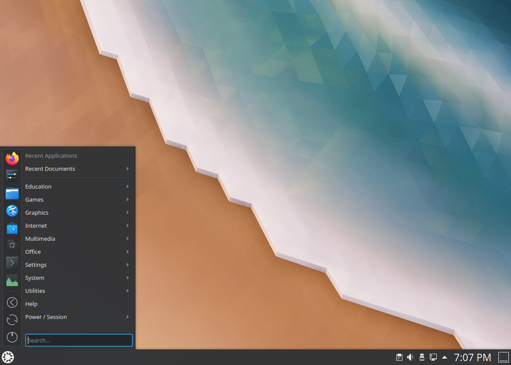
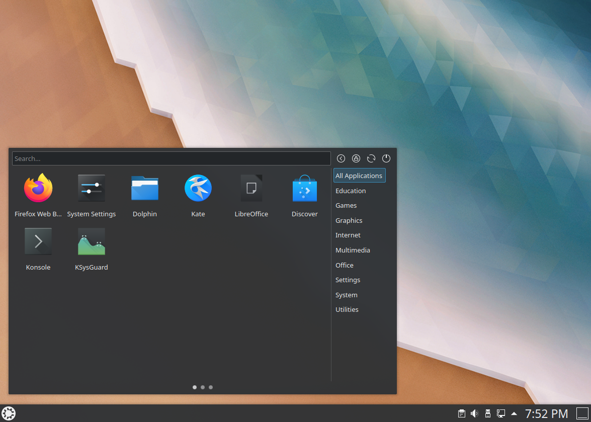

.. _basic-link:

Basic
======

This section of the manual will cover the components available within Kubuntu to meet your desired functionality and make Kubuntu your own.

Launchers
----------

Kickoff
~~~~~~~~~~~~~~~~~~~~~

.. image:: ../images/focal/basic/kickoff.png
    :scale: 60 %
    :align: center
    :target: https://userbase.kde.org/Special:MyLanguage/Plasma/Kickoff
  
As a KDE distribution, Kubuntu uses Kickoff Launcher by default, it can be compared with the 'Start Menu' in Windows (pre Windows 8). The icon to launch Kickoff is on the bottom left very much like Windows 7. For more information on how to use and customize it, see the `Kickoff page <https://userbase.kde.org/Special:MyLanguage/Plasma/Kickoff>`_.

Application Dashboard
~~~~~~~~~~~~~~~~~~~~~~

.. image:: ../images/focal/basic/application-dashboard.png
    :scale: 60 %
    :align: center
    :target: https://userbase.kde.org/Special:MyLanguage/Plasma/Application_Dashboard

Taken from the old Plasma Netbook interface we have the Application Dashboard which is for users with smaller screens such as netbooks, small laptops or tablets. 

Application Menu
~~~~~~~~~~~~~~~~~~~~~~

The Application Menu is like the Application Launcher but more compact.

Simple Menu
~~~~~~~~~~~~~~~~~~~~~~

The Simple Menu is similar to the Start Menu in Windows 8.1 and 10.

KRunner
~~~~~~~~

.. image:: ../images/focal/basic/krunner.png
   :align: center
   :target: https://userbase.kde.org/Special:MyLanguage/Plasma/Krunner

Like any the above launchers, KRunner is a launcher, but it does a lot more than just launching applications. Usually KRunner is accessed by pressing Alt + Space. For more information on what it can do, see the `KRunner page <https://userbase.kde.org/Special:MyLanguage/Plasma/Krunner>`_.

Networking
-----------

.. image:: ../images/focal/basic/network-panel.png
    :scale: 75 %
    :align: center

Wired
~~~~~~

In most cases the wired network connection will simply work without any changes to the default Kubuntu configuration. Wired network connections are selected as default when they are available.

Wireless
~~~~~~~~~

Most Wireless cards are supported out of the box by Kubuntu. However, in some cases the Wireless network device may have a restricted driver in order to operate. The best way to check this is to open the 'Driver Manager' application. To open this program use your launcher of choice or KRunner to search for 'Driver Manager'. If the device needs a restricted driver, then 'Driver Manager' can help with selecting, installing, and activating the proper driver. Once this is all handled, the system will need to be rebooted. For more information on troubleshooting Wi-Fi on your system, see `Wireless troubleshooting <https://help.ubuntu.com/community/WifiDocs/WirelessTroubleShootingGuide>`_.

`Basic`_
