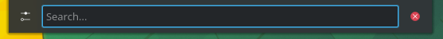

.. _basic-link:

Basic
======

This section of the Documentation will cover the components available within Kubuntu to meet your desired functionality and make Kubuntu your own.

Launchers
----------

KickOff
~~~~~~~~~~

.. image:: ../images/Kickoff-zesty.png
    :scale: 75 %
    :align: center
    :target: https://userbase.kde.org/Special:MyLanguage/Plasma/Kickoff
  
As a *KDE* distribution, Kubuntu uses the Kickoff Application Launcher by default. The Kickoff Launcher can be compared with the 'Start Menu' in Windows (pre Windows 8). The icon to launch Kickoff is on the bottom left very much like Windows XP or 7. For more information on how to use and customize it, see `Plasma Kickoff <https://userbase.kde.org/Special:MyLanguage/Plasma/Kickoff>`_.

Application Dashboard
~~~~~~~~~~~~~~~~~~~~~~

.. image:: ../images/AppDash-zesty.png
    :scale: 50 %
    :align: center

Taken from the old Plasma Netbook interface we have the Application Dashboard menu for users with smaller screens ie. Netbooks or small laptops. 
    
KRunner
~~~~~~~~



Like Kickoff, KRunner is a launcher, but it does a lot more than just launching applications. Usually KRunner is accessed by pressing Alt + Space. For more information on what it can do, see `Plasma Krunner <https://userbase.kde.org/Special:MyLanguage/Plasma/Krunner>`_.

Networking
-----------

.. image:: ../images/Network_Panel-zesty.png
    :scale: 75 %
    :align: center

Wired
~~~~~~

In most cases the wired network connection will simply work without any changes to the default Kubuntu configuration. Wired network connections are selected as default when they are available.

Wireless
~~~~~~~~~

Most Wireless cards are supported out of the box by Kubuntu. However, in some cases the Wireless network device may have a restricted driver in order to operate. The best way to check this is to open the 'Driver Manager'. To open this program use 'KickOff' -> 'System Settings' -> 'Driver Manager'. If the device needs a restricted driver, then 'Driver Manager' can help with selecting, installing, and activating the proper driver. Once this is all handled, the system will need to be rebooted. For more information on troubleshooting Wi-Fi on your system, see `Wireless troubleshooting <https://help.ubuntu.com/community/WifiDocs/WirelessTroubleShootingGuide>`_.

Deskop Customization
---------------------

This section covers the basics of configuring Kubuntu to suit your needs. One of the strengths of the *KDE* philosophy is the focus on control of just about every aspect of the desktop environment. Wallpapers, themes, widgets, color schemes, splash screens, and more; the options for customization are endless.

KDE-Look is the number one location to find customized settings for the *KDE* Plasma desktop. Some of the applications even allow direct connections to KDE-Look to download a new configuration or image. 

Themes
~~~~~~~

Kubuntu allows themes to be changed easily. To change your theme go to System Settings -> Workspace Theme in the Desktop Theme section, then choose from the list of installed themes. You can change the theme of the Desktop Theme, Cursor Theme, and the Splash Screen. Pick from the default choices that are installed, or left-click the 'Get New...' button in each section for more choices. 

Plasmoids
~~~~~~~~~~

Plasmoids (also called Widgets) can be added by right-clicking the desktop and selecting Add Widgets..., which will bring up a list of Widgets. For more information, see `Plasma Widgets <https://userbase.kde.org/Special:MyLanguage/Plasma#Widgets>`_. 

Panel 
~~~~~~

.. image:: ../images/Panels-zesty.png
    :align: left
    :scale: 75 %

By right-clicking on the desktop once again, you can select Add Panel to get more panels. You can left-click the button on the far right side of the panel to alter the properties of the panel, like changing its height or width or adding Widgets, for example. For more information, see `Plasma Panels <https://userbase.kde.org/Special:MyLanguage/Plasma#Panels>`_. 

Activities
~~~~~~~~~~

Activites are specific and exclusive to KDE. As such they're often under utilised and misunderstood. In this section we're going to explore what KDE Activities are, how to set them up, and how to use them.

Think for a moment about your average day working on your PC. It will often traverse different activities. For example doing email and researching things on the internet, perhaps developing some documents, working on a piece of software, writing your thesis in LaTeX etc...

Commonly KDE users might use Virtual desktops to seperate these workspaces.

KDE Activites in Kubuntu provide a slick way to setup and configure environments specific to your task routines. For example your might want to have your email, and social networks configured as one activity. Perhaps your research, and writing for your thesis configured as another activity.

Activities first look
~~~~~~~~~~~~~~~~~~~~~

.. image:: ../images/basic/activity_desktop_side_bar.png
   :align: center
   :scale: 30 %
   
Let's take a look at the default KDE Activities configured in Kubuntu. Right Click anywhere on the empty desktop and choose "Activities" from the menu. The Activities side bar appears on the left, with the Default activity. Notice the + Create Activity at the bottom. Click that, and lets created a new "Social" Activity.
Enter "Social" as the Activity name: and then click Create.

That's it you have created your first activity.

You can theme, and configured this new activity desktop in the same ways as mentioned early in this section of the manual.

A Step Further
~~~~~~~~~~~~~~

OK, looking good, lets create another activity. Call this one "News". Once created switch to this activity, either by Right Click on the Desktop > Activities or use the Keyboard shortcut Alt+D,A ( Hold Alt down, press D, then Press A )
Then select the News activity from the side bar.

OK, lets configure a few useful tools

1. Change the desktop wallpaper to something you like
2. Right click > Add Widgets, and add the Digital Clock
3. Right click > Add Widgets, and add the Web Browser
4. Right click > Add Widgets, and add the RSS

You can now resize these widgets and lay them out on the desktop however you wish. and configure them to suit your needs, as in the example below.

.. image:: ../images/basic/activity_desktop_news.png
   :align: center
   :scale: 30 %

Dolphin
````````

Dolphin is the default file manager in Kubuntu and can be compared with Windows Explorer. Dolphin looks simple because of great design, while having many powerful features. For more information, see `Dolphin <https://userbase.kde.org/Special:MyLanguage/Dolphin>`_. 

Updating
---------

Kubuntu developers release feature and security updates for applications and packages within the Kubuntu system. When updates become available, Kubuntu will display a message in the System Tray. To update the system, open Discover from either the Application Menu or Krunner and click the Update button (usually yellow/orange when there are updates). After installing some updates, it may be necessary to restart the computer. If so, Kubuntu will display a pop-up and an icon in the System Tray. 

.. image:: ../images/DiscoverUpdates-zesty.png
    :scale: 75 %

`Basic`_
