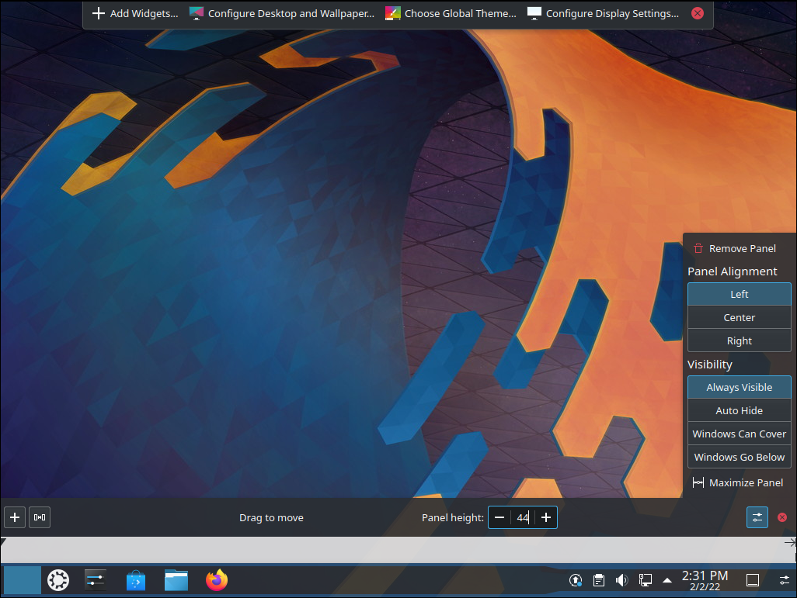
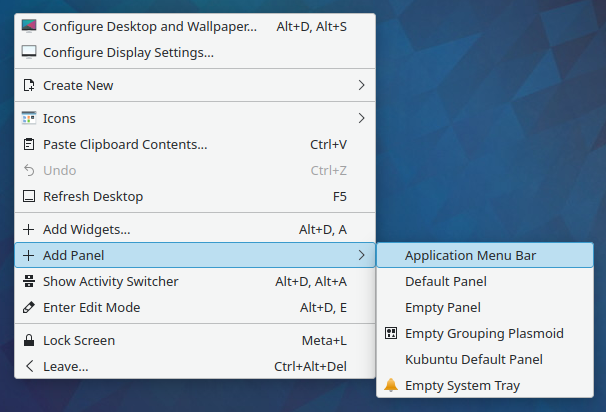
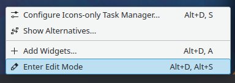
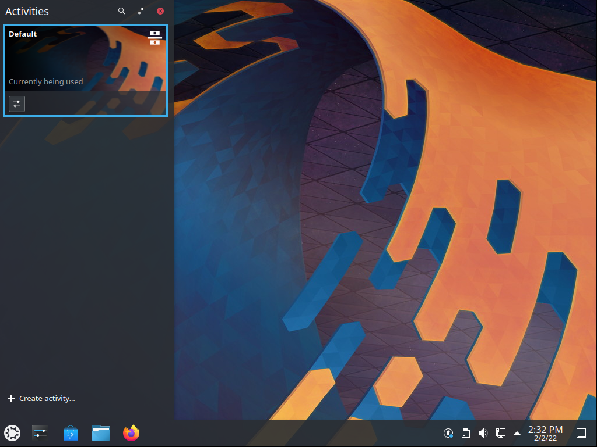
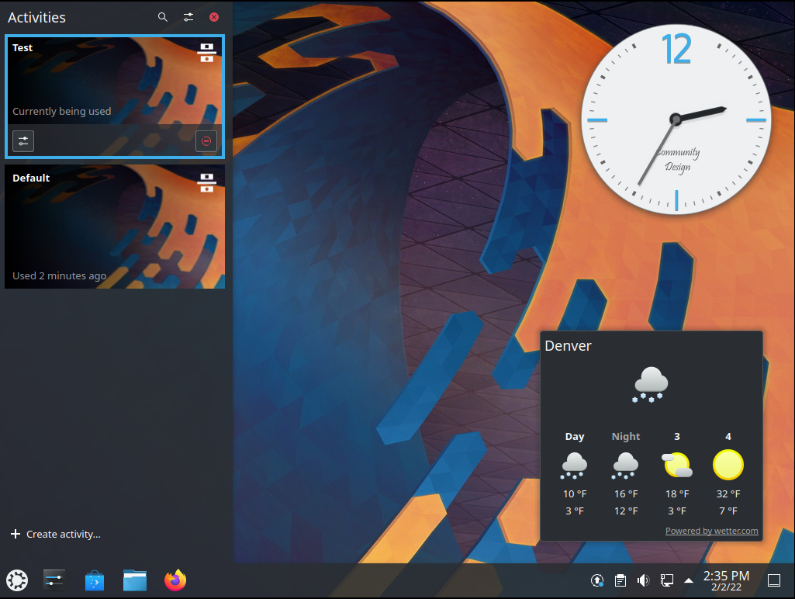
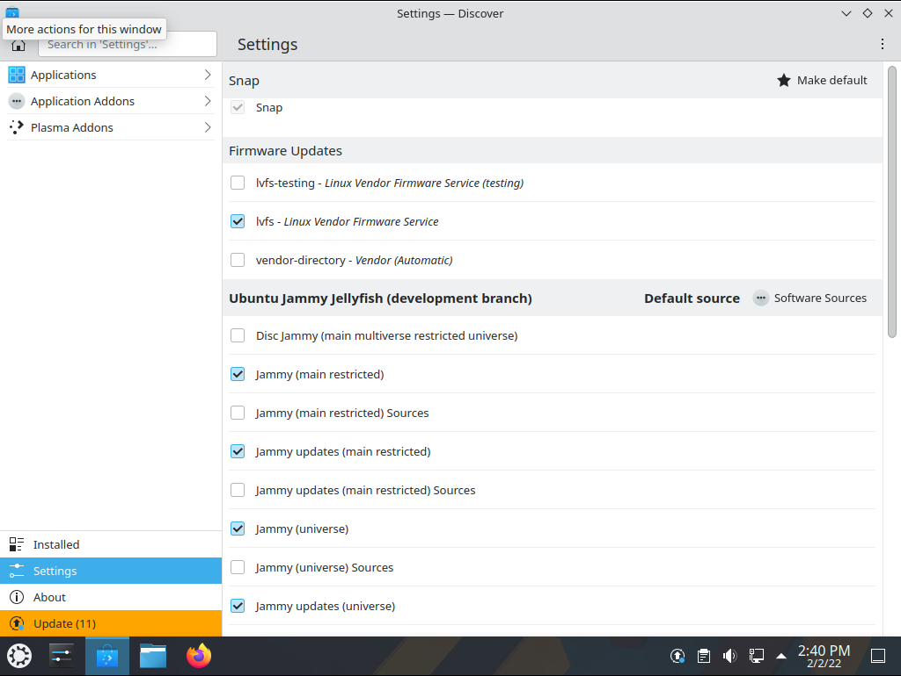

.. _advanced-link:

Advanced
=========

This section covers the basics of configuring Kubuntu to suit your needs. One of the strengths of the KDE philosophy is the focus on control of just about every aspect of the desktop environment. Wallpapers, themes, widgets, color schemes, splash screens, and more; the options for customization are endless.

KDE-Look is the number one location to find customized settings for the KDE Plasma desktop. Some of the applications even allow direct connections to KDE-Look to download a new configuration or image. 

Global Themes
~~~~~~~~~~~~~~

Kubuntu allows themes to be changed easily. To change your global theme follow these steps:

1. Open System Settings 
2. Left-click 'Appearance'
3. Now choose from the list of installed themes
4. Pick from the default choices that are installed, or left-click the 'Get New Global Themes...' button for more choices

Plasma Styles
~~~~~~~~~~~~~~

1. Open System Settings 
2. Left-click 'Appearance'
3. Left-click 'Plasma Style'
4. Now choose from the list of installed themes
5. Pick from the default choices that are installed

- Left-click the 'Get New Plasma Styles...' button for more choices         
- Left-click the 'Install from File...' button to install from a local file 

Widgets
~~~~~~~~~~

Widgets can be added by right-clicking the desktop and selecting Add Widgets..., which will bring up a list of Widgets. For more information, see `Plasma Widgets <https://userbase.kde.org/Special:MyLanguage/Plasma#Widgets>`_. 

.. _panel:

Panels
~~~~~~~

Panels are widget containers, widgets are items like the Clock, Launchers, System Tray and more! These can be placed on each side of your desktop match your workflow. For more information, see `Plasma Panels <https://userbase.kde.org/Special:MyLanguage/Plasma#Panels>`_.

By right-clicking on the desktop once again, you can select Add Panel to get more panels. You can also use this menu to enter Edit Mode or by right-clicking on any panel on your desktop. 

You can left-click the button on the far right side of the panel once you enter Edit Mode to alter the properties of the panel, like changing its height or width or adding Widgets, for example.

Activities
~~~~~~~~~~

An Activity is a separate desktop, complete with it's own set of icons (and their placement), wallpaper, theme, widgets, and other customization. In this section we're going to explore what Plasma Activities are, how to set them up, and how to use them.

Think for a moment about your average day working on your PC. It will often traverse different activities. For example doing email and researching things on the internet, perhaps developing some documents, working on a piece of software, writing your thesis in LaTeX etc...

Commonly Plasma users might use Virtual desktops to seperate these workspaces.

Plasma Activites in Kubuntu provide a slick way to setup and configure environments specific to your task routines. For example your might want to have your email, and social networks configured as one activity. Perhaps your research, and writing for your thesis configured as another activity.

Activities First Look
~~~~~~~~~~~~~~~~~~~~~~

   
Let's take a look at the default KDE Activities configured in Kubuntu. Right Click anywhere on the empty desktop and choose "Activities" from the menu. The Activities side bar appears on the left, with the Default activity. Notice the + Create Activity at the bottom. Click that, and lets created a new "Social" Activity.
Enter "Social" as the Activity name: and then click Create.

That's it you have created your first activity.

You can theme, and configured this new activity desktop in the same ways as mentioned early in this section of the manual.

A Step Further
~~~~~~~~~~~~~~

OK, looking good, let's create another Activity. Call this one "Misc". Once created switch to this Activity, either by Right Click on the Desktop > Activities or use the Keyboard shortcut Alt+D, A ( Hold Alt down, press D, then Press A ) then select the Misc Activity from the side bar.

OK, lets configure a few useful tools

1. Change the desktop wallpaper to something you like
2. Right-click > Add Widgets, and add the Analog Clock
3. Right-click > Add Widgets, and add the Weather Report

You can now resize these widgets and lay them out on the desktop however you wish and configure them to suit your needs, as in the example below.

Drivers
--------

In every operating system (Windows, macOS, and Linux) there are programs called Drivers which let your computer work with specific hardware components, such as `Wi-Fi <https://userbase.kde.org/Kubuntu/Basic#Wireless>`_, graphics cards (NVIDIA, AMD...), etc. Sometimes nonfree or restricted Drivers let the hardware perform better than the free Drivers that come with Kubuntu. These improvements may cover gaming, video editing and processing to image editing.

The ‘Additional Drivers’ section of the Discover program handles installing and uninstalling these nonfree or restricted Drivers for you.

1. Start Discover 

2. Select Settings
3. Hover over 'Software Sources' then left-click it (it is to the right of 'Ubuntu 22.04.1. LTS Default source')
4. Enter your administrative password at the prompt
5. Left-click the 'Additional Drivers' tab

.. image:: ../../images/jammy/advanced/drivers-hidpi.png
    :align: center

If there are any drivers (both Open Source and Closed Source) for your hardware they will be in this window. If you install any drivers you may need to restart your system for the change to take effect. 
