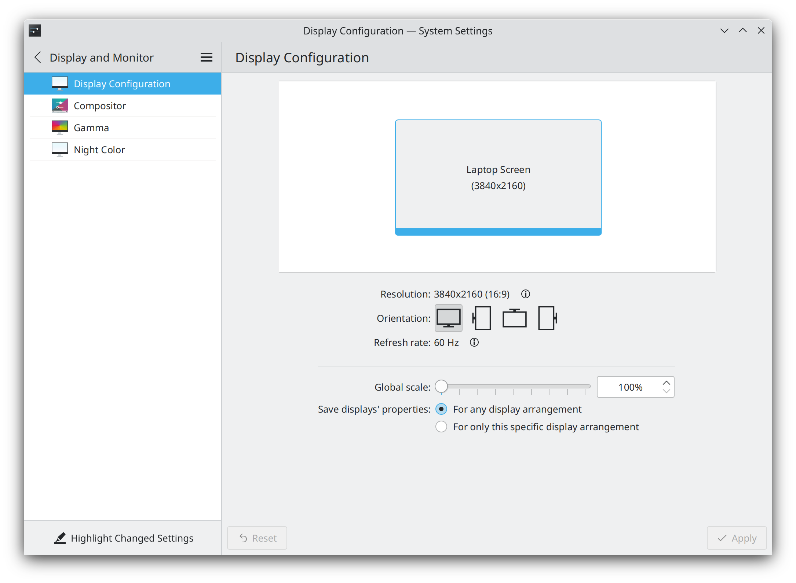
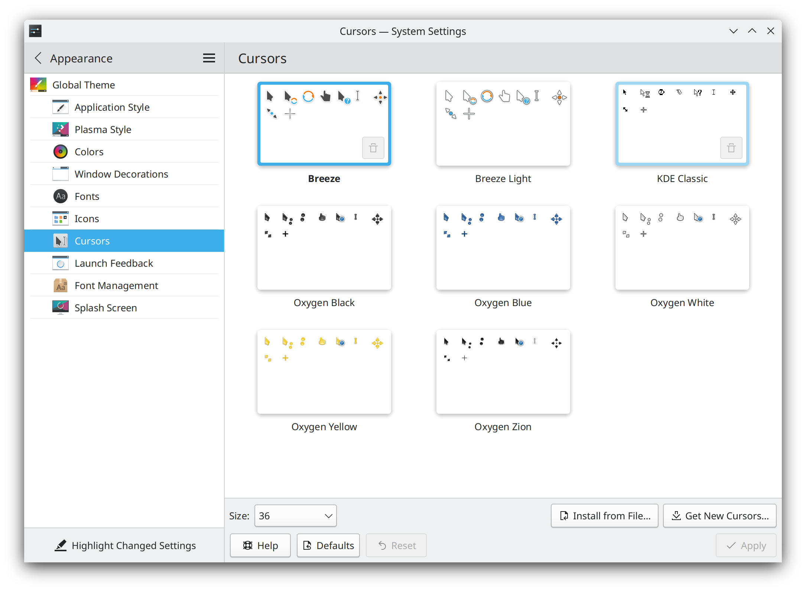

.. _hidpi-link:

HiDPI
======

This means "High Dots Per Inch" and is mainly for screens with a high resolution in a relatively small format. A good example of this is a 15" laptop with a screen resolution of 3840x2160 which would be 4K. Making the following changes will help make your Plasma experience even better.

Scaling
~~~~~~~~

This setting is in System Settings -> Display and Monitor -> Global scale and depending on your display and personal preference 200% might be a great option though 150% would also work. Please note that depending on the application you might see some blurriness if you use a value between 100% and 200%.

Cursor
~~~~~~

This setting is in System Settings -> Appearance -> Cursors -> Size and similar to scaling this will be based on preference but 36 is a good value to start with.

Panel
~~~~~~

For adjusting the panel to improve your experience we'll refer to the :ref:`panel`.

