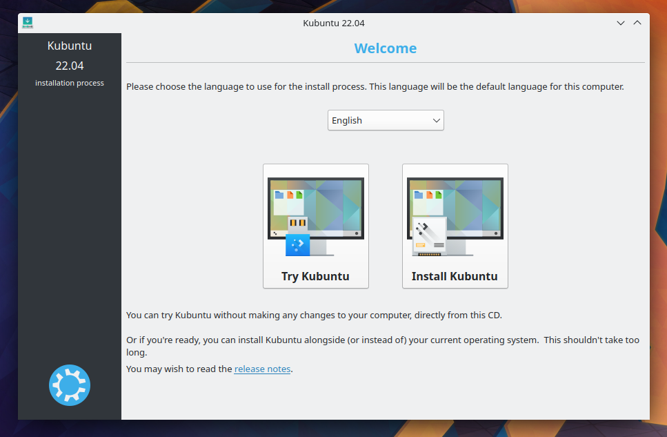
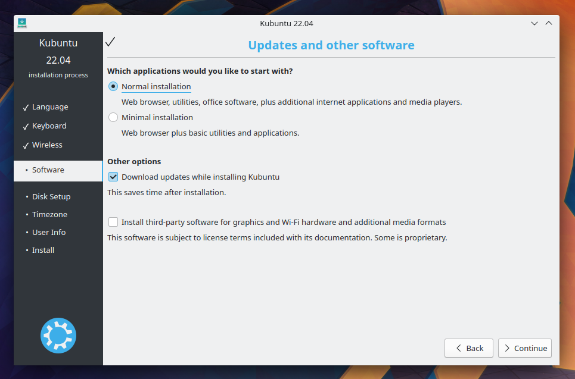
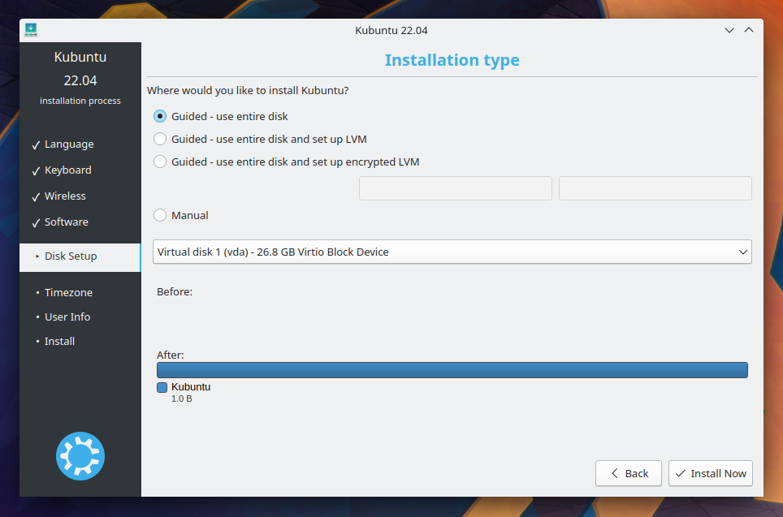
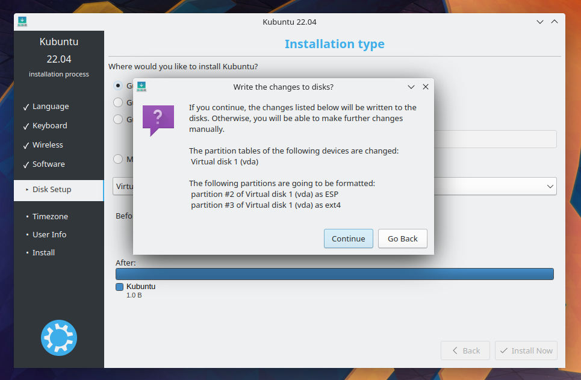
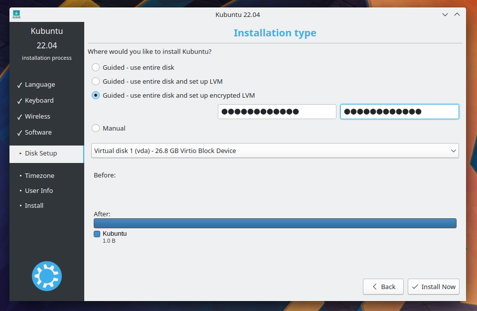
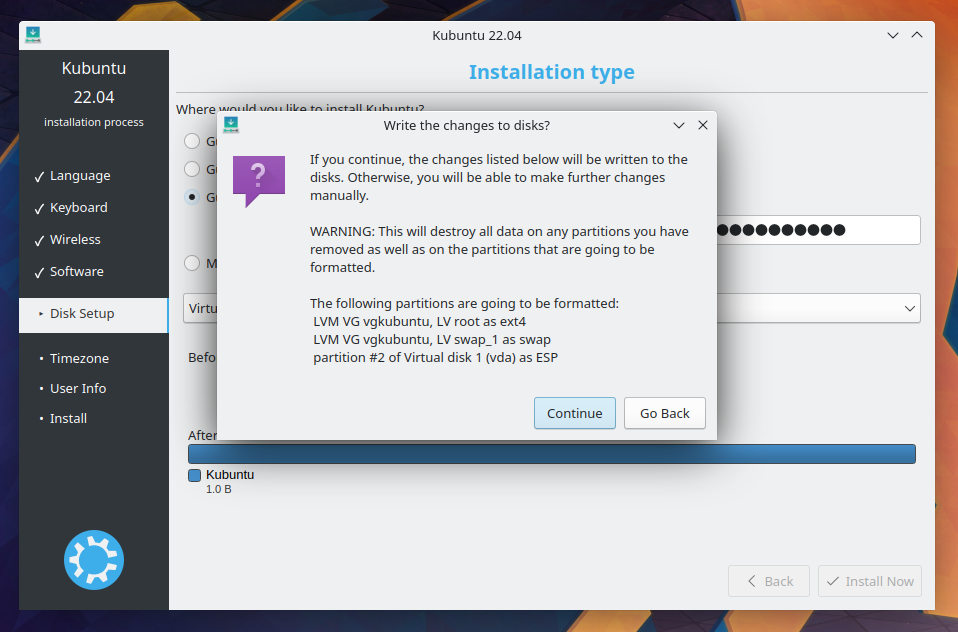
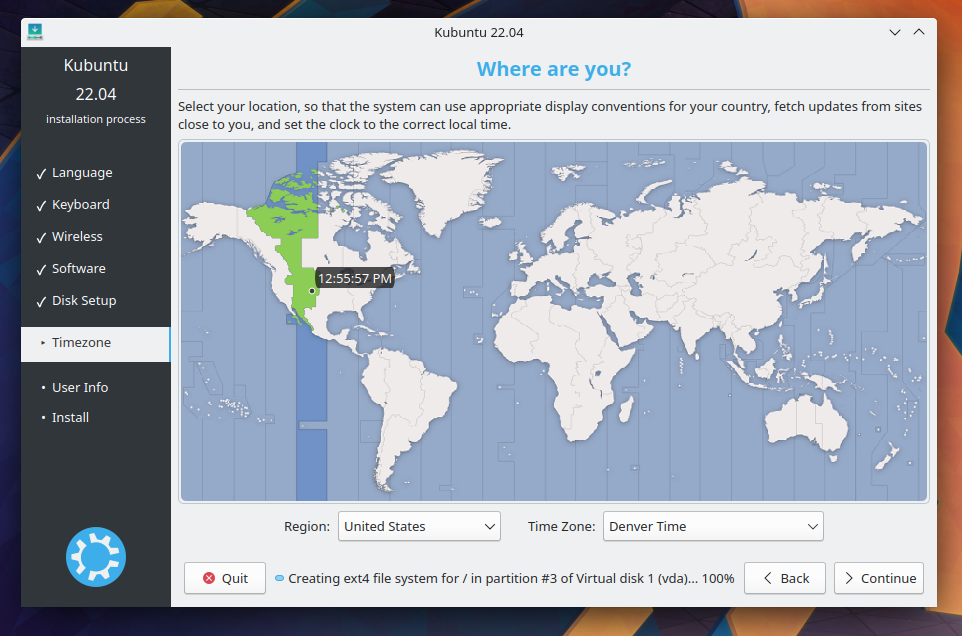
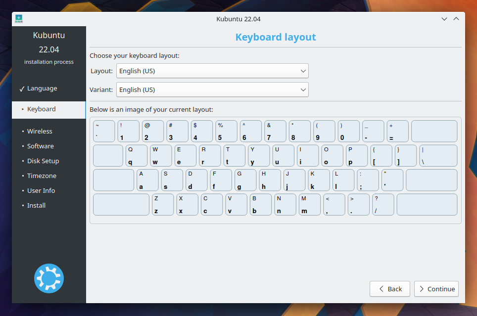
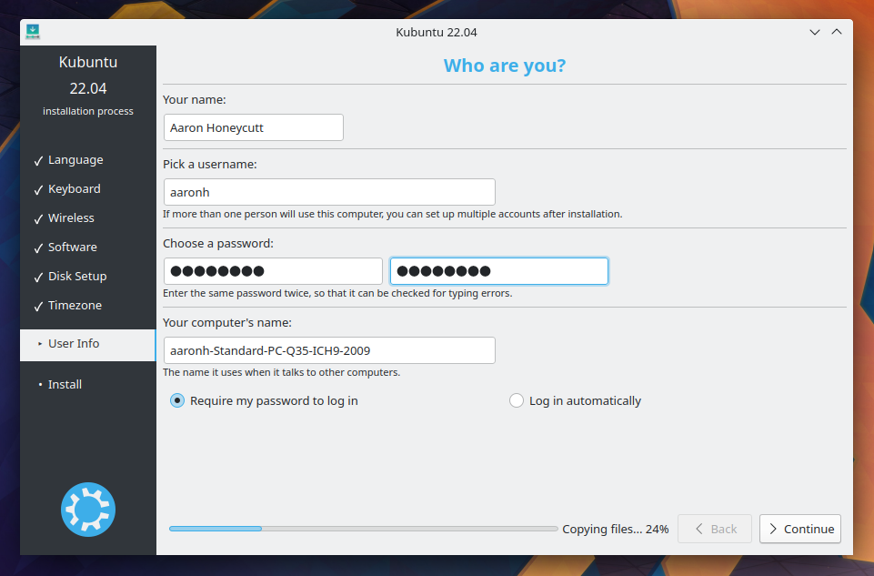

Installation
==============

Why try Kubuntu?
-----------------

There are many good reasons to install Kubuntu!
Some of them include:

- Kubuntu makes your PC friendly. 
- Kubuntu is an operating system built by a friendly worldwide team of expert developers. 
  It contains all the applications you need: web browser, office suite, media apps, 
  instant messaging, and many others. For a list of the included software, see the 
  :ref:`software-link` page.
 
- Kubuntu is a free, open-source alternative to Windows and Mac OS X.

- Easily install beside, or instead of, Windows.

.. _get-kubuntu-link:

Preparing the Installation media
---------------------------------

Getting the ISO(Disc Image):

Download it though `Get Kubuntu <https://www.kubuntu.org/getkubuntu/>`_.

Checking the SHA256SUM
~~~~~~~~~~~~~~~~~~~~~~~~

.. _checksum-link:

Doing this will make sure your download completed fully and has given you a fully working ISO to boot and perhaps later install from. 

From Windows 10
`````````````````

Microsoft Windows does not have any built-in tools for SHA256SUM but they do
provide some `decent documentation <https://support.microsoft.com/en-us/kb/841290>`_ and a tool for checking the SHA256SUM. How-To-Geek also provides some `reading material <http://www.howtogeek.com/67241/htg-explains-what-are-md5-sha-1-hashes-and-how-do-i-check-them/>`_ if you want to understand the technology behind SHA256SUM if you like.

From macOS 
````````````

Open the Terminal app, then navigate to the directory where the ISO is saved.
Run:

.. code-block:: bash

    sha256 -r kubuntu-22.04-desktop-amd64.iso

And compare the output to the hashes page for the ISO file.


From Ubuntu Linux
``````````````````

The first thing to do is to make sure you're in the directory with the .iso file (most likely in the Downloads directory). For more complex use of SHA256SUM check this `out <https://ubuntu.com/tutorials/how-to-verify-ubuntu#5-verify-the-sha256-checksum>`_. Then running the command 'md5sum':

.. code-block:: bash

    sha256 kubuntu-22.04-desktop-amd64.iso

Flashing the installation media
~~~~~~~~~~~~~~~~~~~~~~~~~~~~~~~~~

Windows 10 and macOS
`````````````````````

For a GUI (Graphic User Interface) we use `Etcher <https://www.balena.io/etcher/>`_. The website will detect your OS and recommend a download version, it is recommended to use that version. 
Once it is installed (if you use the Installer for Windows only) open the application and follow these steps:

1. Select the ISO file using the 'Flash from file' option
2. Double left-click the ISO file which is usually in your Downloads folder
3. Use the 'Select target' option to select your flash drive
4. Then left-click the 'Flash!' button
    
.. warning:: Pay special attention when selecting the right flash drive under 'Drive' in case you have more then one flash drive connected.

.. _kubuntu-install-link:

Existing Linux Installs
`````````````````````````

.. _usb-drives-link:

Since Etcher is a cross-platform application we can use it in Kubuntu as well so download the version that the `Etcher <https://www.balena.io/etcher/>`_ website recommends as well.
Though we will need to do the following:

1. Open your File Manager (Dolphin on Plasma distros and Files on GNOME distros)
2. Right-click the .zip file
3. Extract it using the 'Extract archive here'
4. Double left-click the new .AppImage file
5. Left-click the 'Execute' button in the new window

Install Process
----------------

.. note:: You will need to press a special key on the keyboard in order to boot from your chosen Installation Media. Ex: Esc, F2, F10, F12, or Del it all depends on the OEM(Original Equipment Manufacturer) 



When the installer starts you will see these options:

- Try out Kubuntu without changing anything on your computer
- Install Kubuntu on your computer.
    
Prepare
~~~~~~~~

Fro the best result, ensure that:

- Your computer has enough room for Kubuntu and your data - your songs, pictures, videos, and documents. 
- Your computer is connected to the Internet so that you can download updates and third-party software as Kubuntu is installing. 


    
Include this third-party software: includes software that either does not follow the Open Source model or the `Ubuntu Philosophy <http://www.ubuntu.com/about/about-ubuntu/our-philosophy>`_, but is safe for use on your system. 

Download updates while installing: will ensure that you have the latest bug and security fixes included and applied once the installation is complete. 

Disk Setup
~~~~~~~~~~~

This is where you choose how to organize your hard drive. This step is the most complicated and consequential in the entire install process, so take your time. 

.. note:: You will be able to change your mind and go back until the Install Now button is clicked.  

The following sections are some possible installation scenarios you might choose. Each of these choices points to a page or series of pages with more details. For each option (except Manual), the installer asks which hard drive to use. After choosing, you will see a before and after layout on that hard drive. 

Resize
```````

This will resize the partitions for you and install Kubuntu on the free space. With this option you can create what is called a dual-boot and choose which OS to boot into at startup. 

.. note:: This is available only at least 25GB can be freed.
    
Use entire disk
````````````````





.. warning:: This will wipe all your data.    

Use entire disk and set up LVM
```````````````````````````````

More about `LVM <https://wiki.ubuntu.com/Lvm>`_

Use entire disk and set up encrypted LVM
`````````````````````````````````````````





.. warning:: This will wipe all your data.    

More about `encrypted file systems <https://help.ubuntu.com/community/EncryptedFilesystems>`_

Manual
```````

When using Manual to set up your system as you would like it, keep these thoughts in mind:

- The root ( / ) directory needs at least 25 GBs of space.
- The home ( /home ) directory needs as much space as you will need for your files, music, pictures and documents.
  So it is best to use the remaining space for the home partition, unless you have going to dual boot.
- Swap space of at least half of the available RAM is recommended. For instance, with 8 GBs, make the swap with at least 4 GBs. 

.. note:: If you have a Windows 8 sticker on your machine you might need to make a separate EFI partition with a FAT32 filesystem.

For more detailed information regarding the Disk Setup of a Linux system you can check the `DiskSpace <https://help.ubuntu.com/community/DiskSpace>`_ page. 

Timezone
~~~~~~~~~

During this step you get to pick the Region where you live and then the Timezone of the location in that Region. An example would be that I live in Denver, so my Region is North America and my Timezone is MST. 



Keyboard
~~~~~~~~~

This is the step that will set up your keyboard's language and, if the language has it, a different version of the language. For example, there is a Cherokee American English setting as well as different setups with special keys used in certain countries; in Kubuntu we try to make the system easy for everyone! 



User Info
~~~~~~~~~~

At this step of the installation you will be putting in user information like your name, username, and password. The password will be your key to logging into your new installation as well as installing new software, updating your system, and more, so keep it written down somewhere! 


