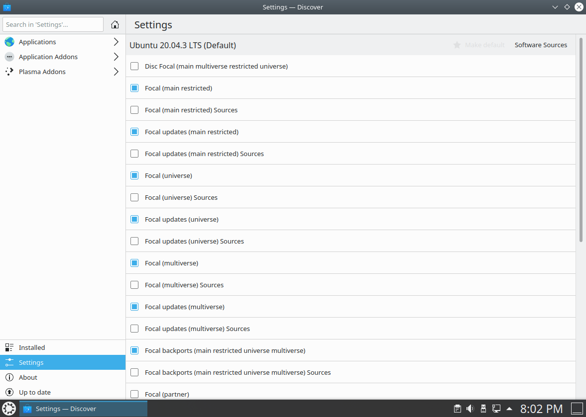
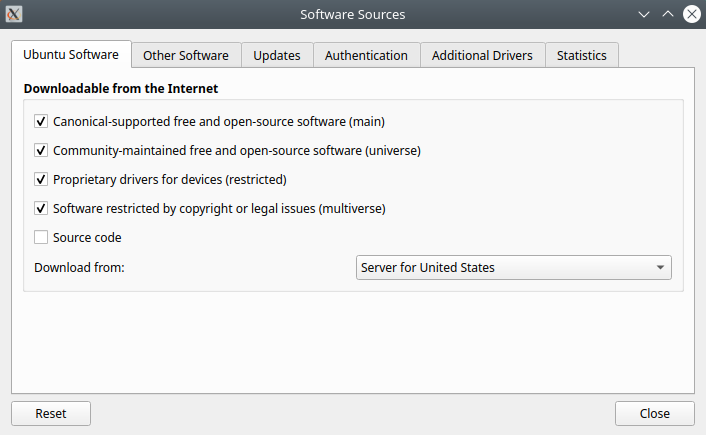

.. _repositories-link:

Repositories
=============

Managing Repositories
----------------------

Add a Repository
~~~~~~~~~~~~~~~~~

You can use the Discover to add new repositories. 

1. Start Discover 

2. Select Settings Left-click the 'Software Sources' button at the top right of the window. 
3. Enter your administrative password at the prompt.

4. Left-click the 'Other Software' tab 
5. Left-click the 'Add...' button

.. image:: ../images/focal/repositories/discover-edit2.png
    :align: center
    :scale: 75 %

6. Enter the repository address into the text box. The proper format is required, and looks similar to this: ppa:kubuntu-ppa/backports 
7. Left-click the 'OK' button to add the repository. Left-click the 'Close' button

A prompt will appear to update the package list. Discover will now be allowed to find the newly available software. 

Enable a Repository
~~~~~~~~~~~~~~~~~~~~

You can use the Discover to enable repositories. We'll go over that process below:

1. Start Discover
2. Select Sources
3. Configure Software Sources in the window
4. Enter your administrative password at the prompt
5. Left-click the 'Other Software' tab
6. Check the appropriate box in the center section of the window to enable a repository
7. Left-click the 'Close' button. 

A prompt will appear to update the package list, Discover will now be allowed to find the newly available software.

Disable a Repository
~~~~~~~~~~~~~~~~~~~~~

You can use the Discover to disable repositories. We'll go over that process below:

1. Start Discover
2. Select Sources
3. Configure Software Sources in the window
4. Enter your administrative password at the prompt
5. Left-click the 'Other Software' tab
6. Uncheck the appropriate box in the center section of the window to disable a repository
7. Left-click the 'Close' button. 

A prompt will appear to update the package list, Discover will now forget the no longer available software.

Remove a Repository
~~~~~~~~~~~~~~~~~~~~

You can use the Discover to remove repositories. We'll go over that process below:

1. Start Discover and select Sources
2. Configure Software Sources in the window
3. Enter your administrative password at the prompt
4. Left-click the 'Other Software' tab 
5. Left-click the name of an existing repository in the center section of the window to select it 
6. Left-click the 'Remove' button. Left-click the 'Close' button. 

A prompt will appear to update the package list, Discover will now forget the no longer available software. 

Managing Personal Package Archives
-----------------------------------

Personal Package Archives allow any person in the Ubuntu community who has committed to observe the `Ubuntu Code of Conduct <https://launchpad.net/codeofconduct>`_ to upload Ubuntu source packages to be built and published as an apt repository by Launchpad. Software from Launchpad's `Personal Package Archive <https://launchpad.net/ubuntu/+ppas>`_ (PPA) requires a `GnuPG <https://www.gnupg.org/>`_ (GPG) key so your system can verify that it's getting the packages from the correct source and that the packages have not been interfered with since they were built. GnuPG is GNU's tool for secure communication and data storage.

**Important**: The contents of Personal Package Archives are not checked or monitored. You install software from them at your own risk. 

Add a PPA
~~~~~~~~~~

You can use the Discover to add a PPA:

1. Open the Launchpad PPA overview page in your browser
2. Look for the location of the PPA in the 'Adding this PPA to your system' section
3. Open Discover then Select Sources
4. Configure Software Sources in the window and enter your administrative password at the prompt
5. Left-click on the 'Other Software' tab 
6. Left-click the 'Add...' button, paste the location you got from the PPA's overview page into the text box
7. Left-click the 'OK' button to add the repository
8. Left-click the 'Close' button. 

A prompt will appear to update the package list, Discover will now be allowed to find the newly available software.

Remove a PPA
~~~~~~~~~~~~~

You can use the Discover to add a PPA:

1. Open the Launchpad PPA overview page in your browser.
2. Look for the location of the PPA in the 'Adding this PPA to your system' section
3. Open Discover then Select Sources
4. Configure Software Sources in the window. Enter your administrative password at the prompt.
5. Left-click on the 'Other Software' tab. Left-click the 'Add...' button. Paste the location you got from the PPA's overview page into the text box
6. Left-click the 'OK' button to add the repository. 
7. Left-click the 'Close' button. 

A prompt will appear to update the package list, Discover will now be allowed to find the newly available software.

Kubuntu Backports
~~~~~~~~~~~~~~~~~

The Kubuntu Backports are "Backports of new versions of KDE Platform, Plasma and Applications as well as major KDE apps for Kubuntu." As any PPA you should know how to remove it before you add it so please do read above on how to do so. The Backports exist because of the Ubuntu release cycle, if there is a new Plasma, Applications or Frameworks after the freeze or release of a new Ubuntu release we package it up for you to enjoy.

https://launchpad.net/~kubuntu-ppa/+archive/ubuntu/backports
