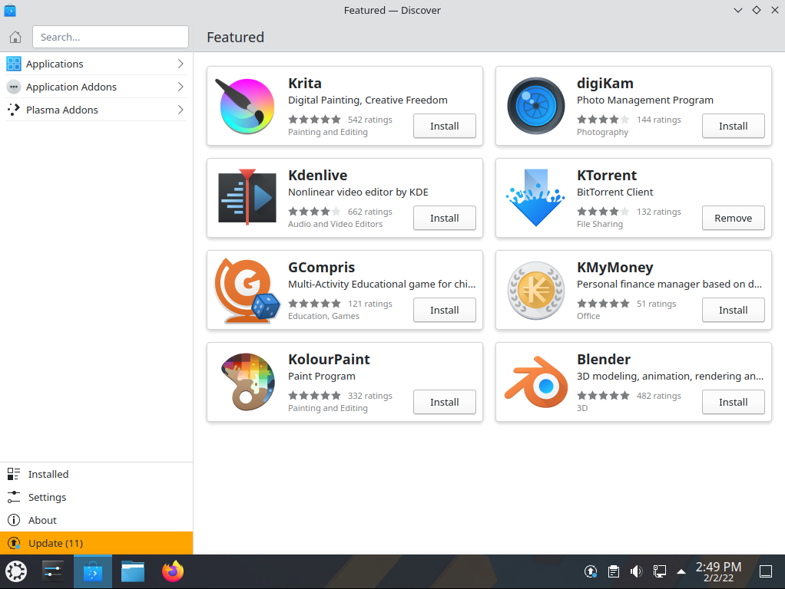
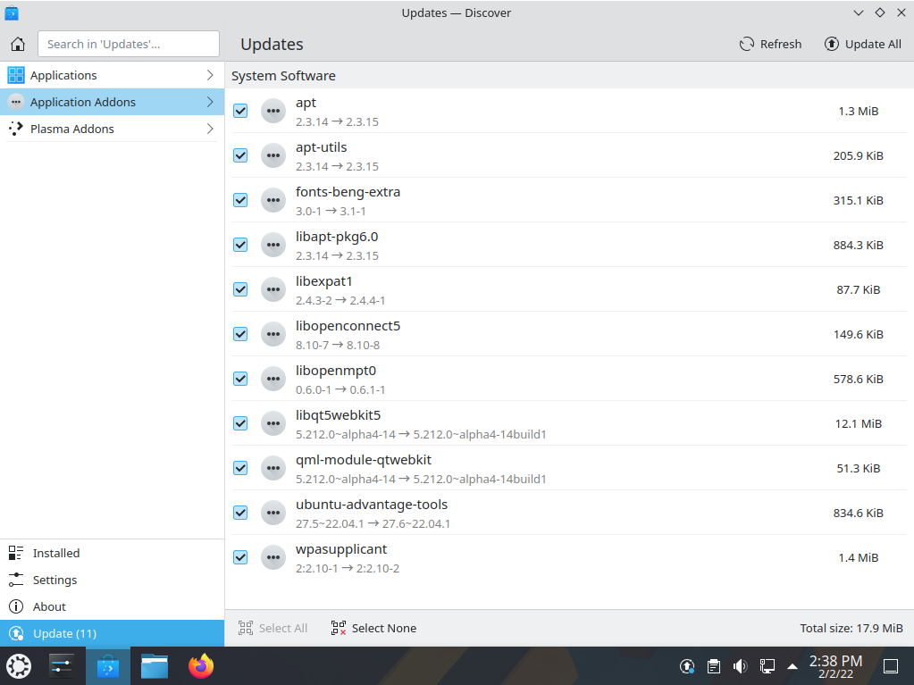

.. _software-link:

Included Software
==================

Software Management
--------------------

There are several ways to manage applications in Kubuntu. A convenient way to add or remove applications is with a package manager. 

Graphical Clients
~~~~~~~~~~~~~~~~~~

By default Kubuntu comes with a great package manager called Discover. Discover is an advanced program with a graphical user interface (GUI) for installing and removing applications. It will automatically notify you for updates (in the lower right hand corner), but you can use it at anytime to install new packages by opening your launcher or KRunner and type 'Discover' then select  Discover from the results.



Discover might provide information about the required dependencies, these are other packages (software) that the piece of software that you want to install needs to run. Once this information is acknowledged, the required packages will begin downloading then be installed. When the installation process is complete, the software will be ready to use. It is rarely necessary to restart the system after software installation or updates. If it is, the system will warn you and give you a restart icon to do the restart at your convenience.

Discover also provides an easy method to remove software that is no longer needed. 

+--------------------------------------------------------------------------+
|                           Tip:                                           |
|                                                                          |
| - Click on Installed and find the application you want to remove.        |
| - Then click Remove and Discover will remove the application.            |
+--------------------------------------------------------------------------+

Updating
---------

Kubuntu developers release feature and security updates for applications and packages within the Kubuntu system. When updates become available, Kubuntu will display a message in the System Tray. To update the system, open Discover from either the Application Menu or Krunner and click the Update button (usually yellow/orange when there are updates). After installing some updates, it may be necessary to restart the computer. If so, Kubuntu will display a pop-up and an icon in the System Tray. 



This is a short guide to the software which is included in your Kubuntu installation. 

Graphics
---------

Some basic graphics applications are installed in Kubuntu by default, allowing you to create, view, scan, and manipulate images. The following applications are installed by default: 

- `Okular <https://userbase.kde.org/Special:MyLanguage/Okular>`_ is a universal document viewer for many kinds of documents: PDF, Postscript, !DjVu, CHM, XPS, ePub and others. 
- `LibreOffice Draw <http://www.libreoffice.org/discover/draw/>`_ is an all-purpose diagramming and charting tool which lets you produce anything from a quick sketch to a complex plan, and gives you the means to communicate with graphics and diagrams. With a maximum page size of 300cm by 300cm, Draw is a an excellent package for producing technical drawings, general posters, and much else. 
- `Skanlite <https://userbase.kde.org/Special:MyLanguage/Skanlite>`_ is a simple image scanning application. 
- `Gwenview <https://userbase.kde.org/Special:MyLanguage/Gwenview>`_ is an image viewer with many features. 
- `Spectacle <https://www.kde.org/applications/graphics/spectacle/>`_ is the best at desktop screenshots, simple and sweet. 

Internet
---------

Browsers
~~~~~~~~~

Firefox is the default browser shipped with Kubuntu, the most popular open-source browser in the world. For more information on how to use Firefox see the `Firefox Help Page <https://support.mozilla.org/en-US/products/firefox>`_. 

Export your bookmarks
``````````````````````

To export your bookmarks from Firefox

1. Click on the Bookmarks menu item
2. Select Show All Bookmarks or Ctrl+Shift+o
3. A new window will appear. Select Import and Backup

> Tip: Note where you save your bookmarks (by default in ~/yourfoldername)

Import your bookmarks into Firefox
```````````````````````````````````

Click this link for a guide to `import your bookmarks <https://support.mozilla.org/en-US/kb/import-bookmarks-html-file>`_ into Firefox. 

Email Clients
~~~~~~~~~~~~~~

There are many options when it comes to email clients. In Kubuntu, Thunderbird is default email client.

- IMAP, POP3, SMTP support 
- SSL, TLS, and Digest-md5 secure logon support 
- PGP and GNUPG signatures and encryption support 

You can read more about Thunderbird `here <https://support.mozilla.org/en-US/products/thunderbird/learn-basics-get-started>`_.

Chat Clients
~~~~~~~~~~~~~

Chatting with friends and family is a popular use of the internet, and Kubuntu provides the necessary applications. 

- `Konversation <https://userbase.kde.org/Special:MyLanguage/Konversation>`_ is the IRC (Internet Relay Chat) client pre-installed in Kubuntu. Not only does it provide functions similar to those of other popular IRC clients such as 'X-chat, its design emphasizes ease of use. Konversation includes tabbed browsing and notification of messages and other events.

KDE software connects you to the world. See `Internet, Networking, & Communication <https://userbase.kde.org/Special:MyLanguage/Applications/Internet>`_ for more.

Multimedia
-----------

The best in multimedia is installed when you open your new Kubuntu installation. If you get an error message about "missing codecs" please install kubuntu-restricted-extras. You can find your Multimedia applications through Kickoff->Applications->Multimedia. 

The following applications are installed by default: 

- `PulseAudio <https://wiki.ubuntu.com/PulseAudio>`_ keeps all your sound and video inputs and outputs working together. If you need to direct your audio or video output to other devices, install the pavucontrol package, launch it by pressing Alt + F2, then type pavucontrol. 
- `Elisa <https://userbase.kde.org/Special:MyLanguage/Elisa>`_ is a music player focused on the Plasma desktop.
- `VLC <https://www.videolan.org/>`_ is a simple interface for playing your movies, TV shows, and music. 

Office
-------

The default office suite installed in Kubuntu is LibreOffice. It includes Calc, Draw, Impress, Math, Base and Writer. This suite is the open source equivalent of the Microsoft Office suite and each application corresponds to a similar product in that line. 

- Calc = Excel
- Writer = Word
- Impress = PowerPoint
- Base = Access

LibreOffice works well with the files created by their Microsoft counterparts, with the exception of Microsoft Access files. For more information see `LibreOffice <https://wiki.ubuntu.com/LibreOffice>`_. 

System Settings
----------------

Information on adjusting system settings can be found at `System Settings <https://userbase.kde.org/Special:MyLanguage/System_Settings>`_. 

Utilities
----------

Your newly installed Kubuntu system has some utilities already installed. One of the most useful is not in your menus; just press ALT + F2. Look at the top of your screen; there is one of your most powerful utilities, called Krunner. See more here: `Krunner <https://userbase.kde.org/Special:MyLanguage/Plasma/Krunner>`_.

- `Kate <https://userbase.kde.org/Special:MyLanguage/Kate>`_ is the default text editor for KDE. It has many great features for editing plain text or writing code in many different languages. 
- `Ark <https://userbase.kde.org/Special:MyLanguage/Ark>`_ is the default tool for handling archives of files such as tar, gzip, bzip2, zip, rar and 7z. 
- `KCalc <https://userbase.kde.org/Special:MyLanguage/KCalc>`_ offers basic calculator functions and much more. 
- `Konsole <https://userbase.kde.org/Special:MyLanguage/Konsole>`_ is the KDE terminal emulator, it can be used to run console shells. 
- `Dolphin <https://userbase.kde.org/Special:MyLanguage/Dolphin>`_ is the default file manager. Dolphin looks simple because of great design, while having many powerful features.
- `KDE Connect <https://kdeconnect.kde.org/>`_ this allows you to share files between your Android phone, use your phone as a mouse, sync notifications and more!

Bash
~~~~~

Bash is the default shell in Konsole and other terminals. Click this `link <https://help.ubuntu.com/community/UsingTheTerminal>`_ that goes over using the terminals.

Firewall configuration
-----------------------

Ufw is the default commandline configuration tool for the firewall. Ufw stands for Uncomplicated Firewall, it is developed to ease iptables firewall configuration. For more information about ufw see: `UFW <https://help.ubuntu.com/community/UFW>`_ 
