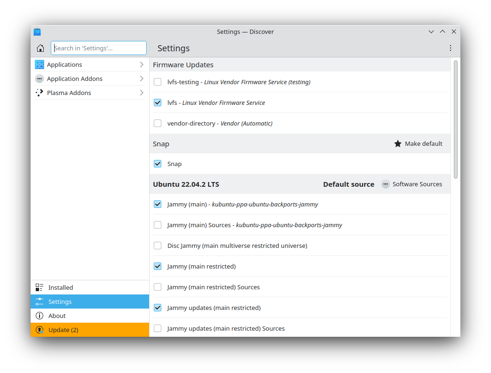

.. _repositories-link:

Repositories
=============

Thousands of programs are freely available to install in Kubuntu. These programs are stored in software archives ("repositories") and are made available for installation over the Internet. Installing new programs in Kubuntu is quick, reliable, and secure because each program is built specifically for Kubuntu and is checked thoroughly before it is made available. Kubuntu repositories are categorized into four groups: 

- Main
- Restricted
- Universe
- Multiverse

Two factors are used to determine categories

- The level of support provided for a program by its software development teams. 
- The level of compliance the program has to the `Ubuntu Free Software Philosophy <http://www.ubuntu.com/about/about-ubuntu/our-philosophy>`_.

The standard Kubuntu LiveDVD contains some software from the "Main" and "Restricted" categories. Once a system has information about the Internet-based locations for these repositories, more programs are available for installation. Using the software package management tools installed by default, it is possible to discover, install, and update any piece of software directly over the internet without the need for the LiveDVD. 

For more information about managing repositories, check the click on Repositories section of this manual. For even more information check the Ubuntu Wiki about `managing Repositories <https://help.ubuntu.com/community/Repositories>`_.

Managing Repositories
----------------------

Add a Repository
~~~~~~~~~~~~~~~~~

You can use the Discover to add new repositories. 

1. Start Discover 

2. Select Settings then left-click the 'Software Sources' button to the right of 'Ubuntu Jammy Jellyfish'
3. Enter your administrative password at the prompt

4. Left-click the 'Other Software' tab 
5. Left-click the 'Add...' button

.. image:: ../../images/jammy/repositories/discover-edit2.png
    :align: center
    :scale: 75 %

6. Enter the repository address into the text box. The proper format is required, and looks similar to this: 

``deb https://dl.google.com/linux/chrome/deb/ stable main``

7. Left-click the 'OK' button to add the repository then left-click the 'Close' button

A prompt will appear to update the package list. Discover will now be allowed to find the newly available software. 

Enable a Repository
~~~~~~~~~~~~~~~~~~~~

You can use the Discover to enable repositories. We'll go over that process below:

1. Start Discover
2. Select Sources
3. Configure Software Sources in the window
4. Enter your administrative password at the prompt
5. Left-click the 'Other Software' tab
6. Check the appropriate box in the center section of the window to enable a repository
7. Left-click the 'Close' button

A prompt will appear to update the package list, Discover will now be allowed to find the newly available software.

Disable a Repository
~~~~~~~~~~~~~~~~~~~~~

You can use the Discover to disable repositories. We'll go over that process below:

1. Start Discover
2. Select Sources
3. Configure Software Sources in the window
4. Enter your administrative password at the prompt
5. Left-click the 'Other Software' tab
6. Uncheck the appropriate box in the center section of the window to disable a repository
7. Left-click the 'Close' button

A prompt will appear to update the package list, Discover will now forget the no longer available software.

Remove a Repository
~~~~~~~~~~~~~~~~~~~~

You can use the Discover to remove repositories. We'll go over that process below:

1. Start Discover and select Sources
2. Configure Software Sources in the window
3. Enter your administrative password at the prompt
4. Left-click the 'Other Software' tab 
5. Left-click the name of an existing repository in the center section of the window to select it 
6. Left-click the 'Remove' button. Left-click the 'Close' button

A prompt will appear to update the package list, Discover will now forget the no longer available software. 

PPAs (Personal Package Archive)
~~~~~~~~~~~~~~~~~~~~~~~~~~~~~~~~

Personal Package Archives allow any person in the Ubuntu community who has committed to observe the `Ubuntu Code of Conduct <https://launchpad.net/codeofconduct>`_ to upload Ubuntu source packages to be built and published as an apt repository by Launchpad. Software from Launchpad's `Personal Package Archive <https://launchpad.net/ubuntu/+ppas>`_ (PPA) requires a `GnuPG  <https://www.gnupg.org/>`_ (GPG) key so your system can verify that it's getting the packages from the correct source and that the packages have not been interfered with since they were built. GnuPG is GNU's tool for secure communication and data storage. For more information about PPAs, click on the Repositories section of this manual. 

Install/Uninstall '.deb' files
~~~~~~~~~~~~~~~~~~~~~~~~~~~~~~~

The package files associated with Kubuntu have the ".deb" suffix because of Kubuntu's close relationship with the Debian GNU/Linux distribution. Individual ".deb" files can be downloaded and installed. Humble Bundles, for instance, distribute debs. Administrative privileges are required. 

Managing Personal Package Archives
-----------------------------------

Personal Package Archives allow any person in the Ubuntu community who has committed to observe the `Ubuntu Code of Conduct <https://launchpad.net/codeofconduct>`_ to upload Ubuntu source packages to be built and published as an apt repository by Launchpad. Software from Launchpad's `Personal Package Archive <https://launchpad.net/ubuntu/+ppas>`_ (PPA) requires a `GnuPG <https://www.gnupg.org/>`_ (GPG) key so your system can verify that it's getting the packages from the correct source and that the packages have not been interfered with since they were built. GnuPG is GNU's tool for secure communication and data storage.

**Important**: The contents of Personal Package Archives are not checked or monitored. You install software from them at your own risk. 

Add a PPA
~~~~~~~~~~

You can use the Discover to add a PPA:

1. Open the Launchpad PPA overview page in your browser
2. Look for the location of the PPA in the 'Adding this PPA to your system' section
3. Open Discover then Select Sources
4. Configure Software Sources in the window and enter your administrative password at the prompt
5. Left-click on the 'Other Software' tab 
6. Left-click the 'Add...' button, paste the location you got from the PPA's overview page into the text box
7. Left-click the 'OK' button to add the repository
8. Left-click the 'Close' button

A prompt will appear to update the package list, Discover will now be allowed to find the newly available software.

Remove a PPA
~~~~~~~~~~~~~

You can use the Discover to remove a PPA:

1. Open Discover then Select Sources
2. Configure Software Sources in the window. Enter your administrative password at the prompt
3. Left-click on the 'Other Software' tab
4. Left-click the PPA that you want to remove
5. Left-click the 'Remove' button

A prompt will appear to update the package list, Discover will now be allowed to find the newly available software.

Kubuntu Backports
~~~~~~~~~~~~~~~~~

The Kubuntu Backports are "Backports of new versions of KDE Platform, Plasma and Applications as well as major KDE apps for Kubuntu." As any PPA you should know how to remove it before you add it so please do read above on how to do so. The Backports exist because of the Ubuntu release cycle, if there is a new Plasma, Applications or Frameworks after the freeze or release of a new Ubuntu release we package it up for you to enjoy.

https://launchpad.net/~kubuntu-ppa/+archive/ubuntu/backports
