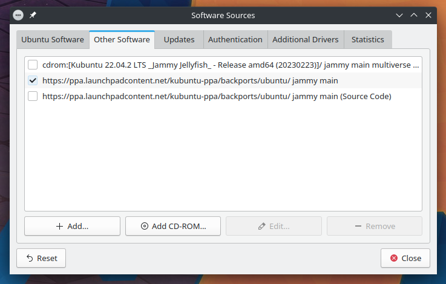

.. _repositories-link:

Repositories
=============

Thousands of programs are freely available to install in Kubuntu. These programs are stored in software archives ("repositories") and are made available for installation over the Internet. Installing new programs in Kubuntu is quick, reliable, and secure because each program is built specifically for Kubuntu and is checked thoroughly before it is made available. Kubuntu repositories are categorized into four groups: 

- Main
- Restricted
- Universe
- Multiverse

Two factors are used to determine categories

- The level of support provided for a program by its software development teams. 
- The level of compliance the program has to the `Ubuntu Free Software Philosophy <http://www.ubuntu.com/about/about-ubuntu/our-philosophy>`_.

The standard Kubuntu LiveDVD contains some software from the "Main" and "Restricted" categories. Once a system has information about the Internet-based locations for these repositories, more programs are available for installation. Using the software package management tools installed by default, it is possible to discover, install, and update any piece of software directly over the internet without the need for the LiveDVD. 

For more information check the Ubuntu Wiki about `managing Repositories <https://help.ubuntu.com/community/Repositories>`_.

Kubuntu Backports
-------------------

The Kubuntu Backports are "Backports of new versions of KDE Platform, Plasma and Applications as well as major KDE apps for Kubuntu." As any PPA you should know how to remove it before you add it so please do read below on how to do so. The Backports exist because of the Ubuntu release cycle, if there is a new Plasma, Applications or Frameworks after the freeze or release of a new Ubuntu release we package it up for you to enjoy.

https://launchpad.net/~kubuntu-ppa/+archive/ubuntu/backports

PPAs (Personal Package Archive)
--------------------------------

Personal Package Archives allow any person in the Ubuntu community who has committed to observe the `Ubuntu Code of Conduct <https://launchpad.net/codeofconduct>`_ to upload Ubuntu source packages to be built and published as an apt repository by Launchpad. Software from Launchpad's `Personal Package Archive <https://launchpad.net/ubuntu/+ppas>`_ (PPA) requires a `GnuPG  <https://www.gnupg.org/>`_ (GPG) key so your system can verify that it's getting the packages from the correct source and that the packages have not been interfered with since they were built. GnuPG is GNU's tool for secure communication and data storage.  

Managing Personal Package Archives
~~~~~~~~~~~~~~~~~~~~~~~~~~~~~~~~~~~

Personal Package Archives allow any person in the Ubuntu community who has committed to observe the `Ubuntu Code of Conduct <https://launchpad.net/codeofconduct>`_ to upload Ubuntu source packages to be built and published as an apt repository on Launchpad. `Launchpad <https://launchpad.net/>`_ this is a website which hosts packages for Ubuntu based distos like Kubuntu, Linux Mint and elementary. Software from Launchpad's `Personal Package Archive <https://launchpad.net/ubuntu/+ppas>`_ (PPA) requires a `GnuPG <https://www.gnupg.org/>`_ (GPG) key so your system can verify that it's getting the packages from the correct source and that the packages have not been interfered with since they were built. GnuPG is GNU's tool for secure communication and data storage.

**Important**: The contents of Personal Package Archives are not checked or monitored. You install software from them at your own risk. 

Add a PPA
```````````

You can use the Discover to add a PPA:

1. Open the Launchpad PPA overview page in your browser for example look at the `Kubuntu Backports PPA <https://launchpad.net/~kubuntu-ppa/+archive/ubuntu/backports>`_
2. Look for the 'Adding this PPA to your system' section
3. Left-click the ‘Software Sources’ button to the right of ‘Ubuntu Jammy Jellyfish’
4. Enter your administrative password at the prompt.
5. Left-click on the 'Other Software' tab

.. image:: ../../images/jammy/repositories/discover-edit.png
    :align: center
    :scale: 75 %


For using Konsole follow these steps:

1. Open Konsole then copy (Ctrl+C once the command is highlighted)
2. Now paste (Ctrl+Shift+V in terminals like Konsole) and press the Enter key

.. image:: ../../images/jammy/repositories/konsole-add-ppa.png
    :align: center
    :scale: 75 %

Your repositories will be updated and now Discover will be able to find the newly available software.

Remove a PPA
``````````````

You can use the Discover to remove a PPA:

1. Open Discover then go to Settings

.. image:: ../../images/jammy/repositories/discover-edit.png
    :align: center
    :scale: 75 %

2. Left-click the ‘Software Sources’ button to the right of ‘Ubuntu Jammy Jellyfish’
3. Enter your administrative password at the prompt.
4. Left-click on the 'Other Software' tab



5. Left-click the PPA that you want to remove
6. Left-click the 'Remove' button

A prompt will appear to update the package list, Discover will now be allowed to find the newly available software.

Install/Uninstall '.deb' files
--------------------------------

The package files associated with Kubuntu have the ".deb" suffix because of Kubuntu's close relationship with the Debian GNU/Linux distribution. Individual ".deb" files can be downloaded and installed. Humble Bundles, for instance, distribute debs. Administrative privileges are required. 

To install ".deb" files download the file from a safe and secure location. In this example we'll be installing the Chrome ".deb" file from `Chrome's website <https://www.google.com/chrome/>`_ , from here you can either double left-click the ".deb" file that we downloaded or we can use the dpkg command to install it.

If you double left-clicked the file then you would see the following QApt Package Installer window:


From there you would left-click the 'Install Package' button and enter your password in the new PolicyKit window (this is to allow the command(s) to be ran to install the software.


If you want to install it using Konsole (or other terminals) we'll run these commands in a Konsole window:

.. code-block::

    sudo dpkg -i google-chrome-stable_current_amd64.deb
    sudo apt install -f
