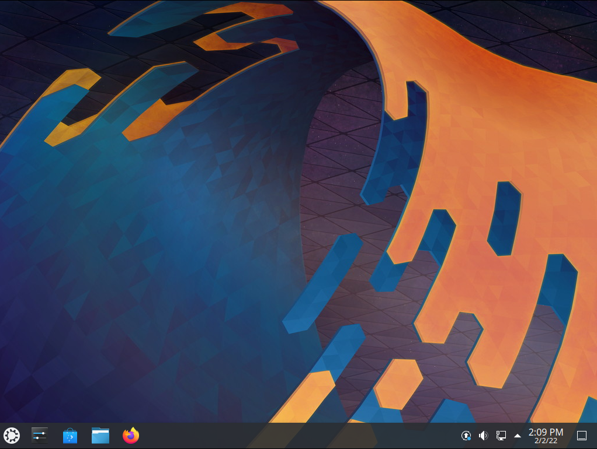

#####################
Welcome to Kubuntu
#####################

Kubuntu is a user-friendly Linux-based operating system that use the KDE Plasma Desktop. With a predictable 
six-month release cycle as part of the Ubuntu project, Kubuntu is the Linux distribution for everyone.

Kubuntu includes more than 1,000 default packages (applications or utilities) and has access to more than 64,000 other packages to suit your needs. Kubuntu is based on the Linux kernel and includes the core Ubuntu applications as well as KDE software. Kubuntu's core applications include software for the most common needs, like:

* Browsing the web.
* Personal Information Manager which includes email.
* Office applications
* Playing multimedia files.
* Plus much more!

The Kubuntu Philosophy
=========================

* Kubuntu will always use the solid base of the Ubuntu project, plus the latest from the KDE project. As part of the Ubuntu project and community, Kubuntu will continue to use the infrastructure and support that the Ubuntu project offers. We will strive to be the best KDE based Linux distribution available.

* Kubuntu will always be free of charge. There is no extra fee for an enterprise edition; we make our best work available to everyone on the same free terms.

* Kubuntu will always include the best translations and accessibility infrastructure that the free software community has to offer, to make Kubuntu usable by as many people as possible.

* Kubuntu will always be committed to the principles of free software and open source development; we shall encourage people to use free and open source software, improve it, and pass it on.

Terminology
============

Desktop Environment
~~~~~~~~~~~~~~~~~~~~

 A desktop environment bundles together a variety of components to provide common graphical user interface elements such as icons, toolbars, wallpapers, and desktop widgets. Additionally, most desktop environments include a set of integrated applications and utilities. Most importantly, desktop environments provide their own window manager, which can however usually be replaced with another compatible one.

This is quoted from the `Arch Linux Wiki page <https://wiki.archlinux.org/title/desktop_environment>`_ about Desktop Environments.

Plasma
~~~~~~~

The Plasma Desktop is the Desktop Environment that Kubuntu uses and it is developed by the KDE community out in the open. It is everything on the desktop when you log into your Operating System (OS) including the panel at the bottom of the screen with the application launcher, system tray with your clock and your task manager. You can read more about Plasma using this `link <https://kde.org/plasma-desktop/>`_.

Qt
~~~

`Qt <https://www.qt.io/>`_ is a toolkit which is used to build applications by providing widgets which include buttons, text fields, progress bars, sliders and more! There are other toolkits like GTK which we'll explain in the next section.

GTK
~~~~

`GTK <https://www.gtk.org/>`_ is another popular toolkit providing the same purpose as Qt, this is used by the `GNOME Project <https://www.gnome.org/>`_, some applications included with Kubuntu are using the GTK toolkit instead but there is a theme provided to have it match Qt's look for a better experience.

dpkg and apt
~~~~~~~~~~~~~

Both `dpkg <https://wiki.debian.org/dpkg>`_ and `apt <https://wiki.debian.org/Apt>`_ are package managers for `Debian Linux <https://www.debian.org/>`_ which Ubuntu is based on so Kubuntu uses them as well as it is based on Ubuntu. They both are used for system updates, installing applications and removing applications from the OS.

PackageKit
~~~~~~~~~~~

`PackageKit <https://www.freedesktop.org/software/PackageKit/>`_ is used by graphical software centers like Discover so that they can be used on other Linux distributions such as `Fedora Linux <https://getfedora.org/>`_ and `Arch Linux <https://archlinux.org/>`_ so that they can talk to their package managers. This is to allow all of them use the same graphical software centers and share code between them.

Discover
~~~~~~~~~

`Discover <https://apps.kde.org/discover/>`_ is the graphical software center that Kubuntu uses as well as some other Linux distributions that use Plasma as their desktop such as `KDE Neon <https://neon.kde.org/>`_. It is designed to make installing, removing and updating the software in your OS easier and more friendly.

What is Linux?
~~~~~~~~~~~~~~~

Linux is an operating system kernel that resembles the Unix operating system. The kernel is the main software required for any operating system, providing a communication bridge between hardware and software. Linux has become a leading element of the worldwide movement to embrace free and open source software. The term "GNU/Linux" is a way of referring to operating systems based on the Linux kernel combined with parts from the `GNU Project <http://www.gnu.org>`_.

What is KDE?
~~~~~~~~~~~~~~~

KDE is an international technology community that creates and supports free software for desktop and portable computing. Among KDE's products are a modern desktop system for Linux and Unix platforms, comprehensive office productivity and groupware suites, as well as hundreds of software applications in various categories including internet and web applications, multimedia, entertainment, education, graphics, and software development. KDE software is translated into more than 65 languages and is built for ease of use with modern accessibility principles in mind. KDE's full-featured applications run natively on Linux, BSD, Solaris, Windows, and macOS. The Plasma Desktop is the default desktop for Kubuntu.

Thank You!
===========

The entire Kubuntu team thanks you for choosing Kubuntu!

:Authors: 
    Kubuntu Team

:Version: 22.04.2 ; Released: 2/25/23
